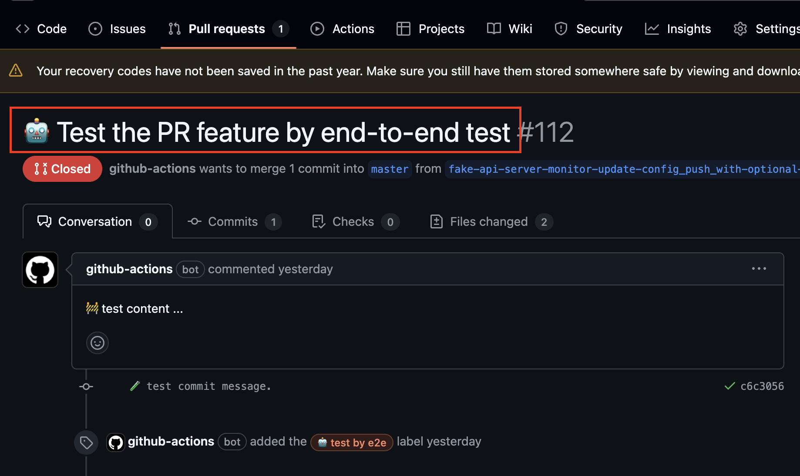
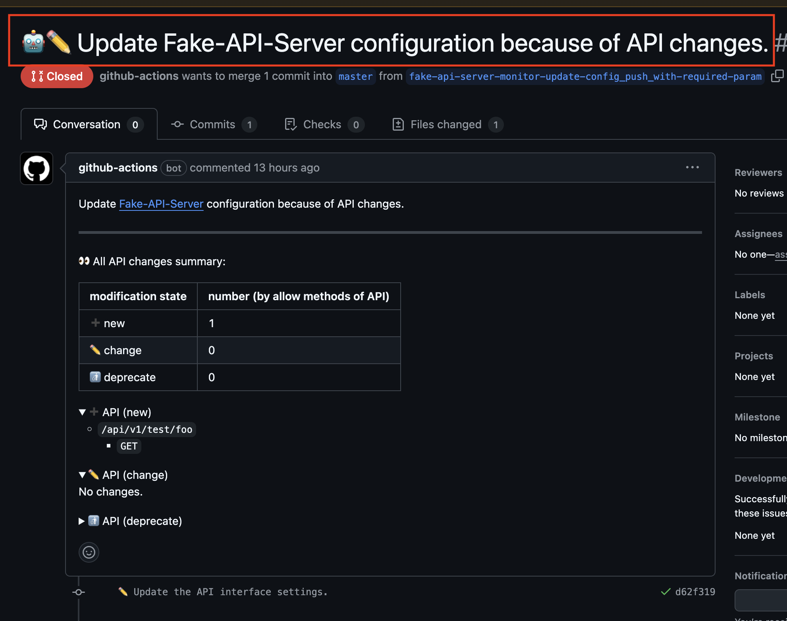
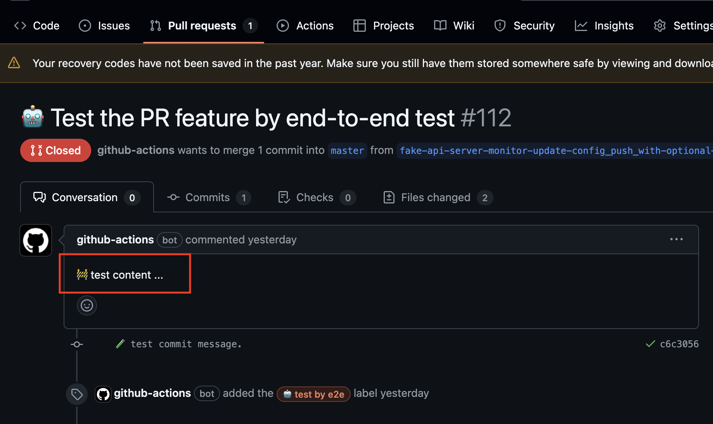
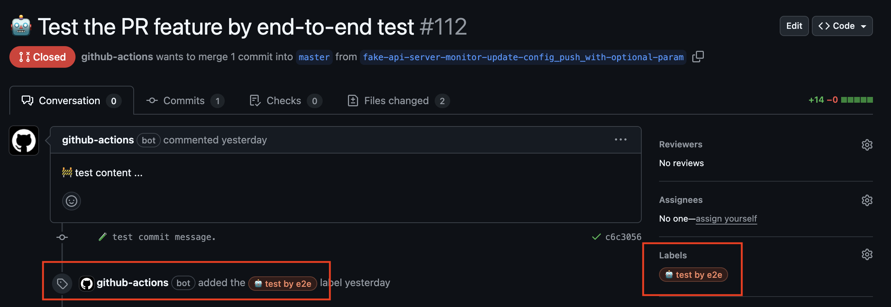

# GitHub setting

## ``github-info``

The details setting about run some GitHub operation. In **_PyFake-API-Server-Surveillance_**, it would open pull request
includes all the changes what it found by itself. This section targets configuring some properties about some setting of
opening pull request in GitHub.


### ``pull-request``

The section about setting some properties about opening pull request in GitHub.

#### ``pull-request.title``

The pull request title.

??? note "Translate as result"

    From below setting in configuration:

    ```yaml hl_lines="3"
    github-info:
      pull-request:
        title: '🤖 Test the PR feature by end-to-end test'
        body: '🚧 test content ...'
        draft: true
        labels:
          - '🤖 test by e2e'
    ```

    As following result:

    

!!! tip "Default GitHub pull request title"

    

#### ``pull-request.body``

The body of pull request.

??? note "Translate as result"

    From below setting in configuration:

    ```yaml hl_lines="4"
    github-info:
      pull-request:
        title: '🤖 Test the PR feature by end-to-end test'
        body: '🚧 test content ...'
        draft: true
        labels:
          - '🤖 test by e2e'
    ```

    As following result:

    

#### ``pull-request.draft``

Whether the pull request it opens is draft or not. It's a boolean type property.

#### ``pull-request.labels``

What labels it should use to tag at the pull request. It's an array type property.

??? note "Translate as result"

    From below setting in configuration:

    ```yaml hl_lines="6-7"
    github-info:
      pull-request:
        title: '🤖 Test the PR feature by end-to-end test'
        body: '🚧 test content ...'
        draft: true
        labels:
          - '🤖 test by e2e'
    ```

    As following result:

    
